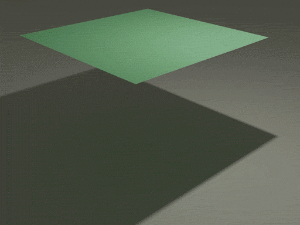
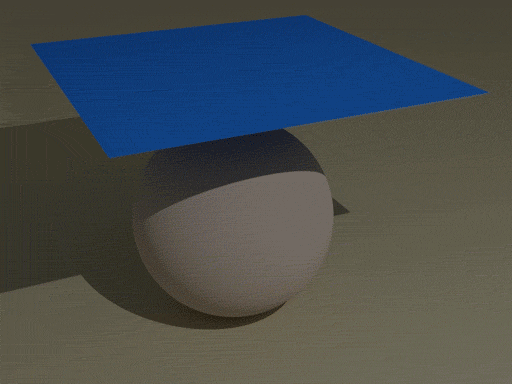
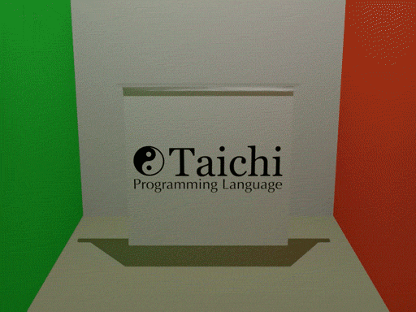

# Cloth Simulation via Taichi
> [Taichi] version 0.8.1, llvm 10.0.0, commit cc2dd342, win, python 3.7.9

## Run
```
>> cd Source
>> python Main_xx.py
It will generate ply/obj files in your current folder
```

## Animation
> The Following Animations are Rendered by Blender  
> Blender Version: 2.93.0

| Result |
:-:
| Wind |
|  |
| Collsion with Ground |
|  |
| Collsion with Sphere |
|  |
| 😎Taichi is Awesome😎 |
|  |

## Reference
[https://graphics.stanford.edu/~mdfisher/cloth.html](https://graphics.stanford.edu/~mdfisher/cloth.html)
